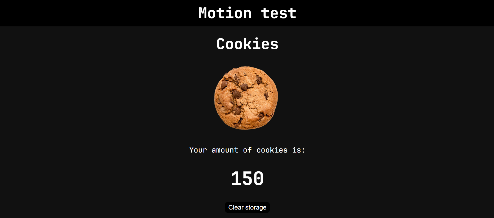

# Motion-test



## About

This project is for learn about the frame motion for react, the main idea is making a simple **cookie clicker clone**.

- The cookie amount is stored in local storage, with a button to clear it.
- The button for get cookies is animated also the amount.

### Follow these steps to run the project:

1. Open a terminal.
2. Run the following commands:

```bash
# Clone the repository
git clone https://github.com/LucasBarberisPerez/motion-test

# Navigate to the project directory
cd motion-test

# Install dependencies
npm install

# Start the development server
npm run dev

# When finish the load:

```

3. Open your browser and go to.

```
http://localhost:5173
```
